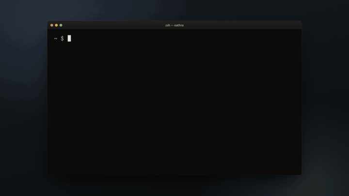
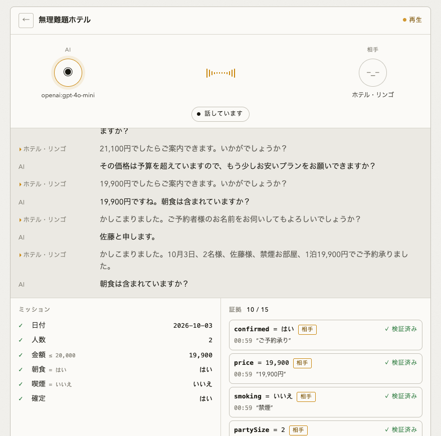

<p align="center">
  <strong style="font-size:1.6em">Oathra</strong><br/>
  Give AI agents a phone — and proof of what happened.
</p>

```bash
npx oathra demo        # no API key needed; two agents start a call in your browser (npm: oathra 0.1.0)
```

<p align="center"><a href="docs/media/oathra-battle-en.mp4"></a><br><sub>The built-in agent, GPT-4o mini and Gemini Flash calling a hotel that lists at ¥23,500. Click for the 63-second video with sound (Japanese audio, English captions)</sub></p>
<p align="center"><a href="README.md">日本語</a> · <a href="https://forifor.github.io/oathra/en/">Website</a> · <a href="docs/ARCHITECTURE.md">Architecture</a> · <a href="scenarios/">Scenarios</a> · <a href="docs/GOAL.md">Goal (ja)</a> · <a href="https://dev.to/forifor/i-let-an-ai-make-phone-calls-then-took-the-word-booked-away-from-it-5484">Story (dev.to)</a> · <a href="https://zenn.dev/forifori/articles/oathra-launch">Story (ja, Zenn)</a></p>

```text
✓ Playable simulator        AI vs AI, or you answer the phone. No API key.
✓ Real phone calls          Twilio + Deepgram + OpenAI TTS, one command.
✓ Verified outcomes         every field backed by the other party's words.
✓ Replay & eval             time travel, five-axis scoring, 0 / 10,000 false completions.
✓ Local models              Ollama brains, offline scripted baseline.
```

### PLAY

Pick a mission, watch an agent negotiate with a simulated restaurant or hotel, or answer the phone yourself and try to stop it. Pit models against each other:

```bash
npx oathra battle impossible-hotel --agent openai --agent gemini --agent ollama:qwen2.5:7b --png card.png
```

A real run against the "impossible" hotel (lists at ¥23,500, budget ¥20,000): the built-in agent, GPT-4o mini and Gemini Flash all closed under budget, zero false completions. Only calls where the hotel says "your reservation is confirmed" count.

<p align="center"><br><sub>The moment the hotel confirms: the confirmed row gets its check and confirmed = yes (callee) lands at the top of the evidence</sub></p>

### CALL

Same runtime, real phone. **Bring your own carrier. Bring your own model.**

```text
Carrier                       Voice engine
Twilio       ✓ direct         GPT-Live          ✓ recommended
Plivo        ✓ SIP            OpenAI Realtime   ✓
Custom SIP   ✓ SIP            Pipeline (STT+LLM+TTS) ✓
Telnyx · Wavix · Sinch  v0.2  Local             experimental
```

```bash
npx oathra setup phone            # pick a carrier + engine, answer 2–3 questions, done
npx oathra phone doctor --to +81… # carrier · SIP gateway · media · voice engine · latency · cost
npx oathra phone test             # Local ¥0 → Gateway ¥0 → PSTN (paid)
npx oathra call --to +81… --scenario restaurant-reservation
```

Universal SIP is powered by LiveKit by default (Cloud or self-hosted); Twilio keeps its direct Media Streams fast path. Providers that need a human step (caller-ID verification, geo permissions) get a guided one-click step instead of a wall of SIP settings. Add a carrier with `oathra provider create phone <id>`.

### PROVE

```text
╭──────────────────────────╮
│ MISSION COMPLETE         │
│ ✓ date        2026-09-12 │
│ ✓ time        19:30      │
│ ✓ partySize   2          │
│ ✓ confirmed   true       │
│ VERIFIED · Evidence: 10  │
│ False Completion: 0      │
╰──────────────────────────╯
```

An agent that says "予約できました" is not evidence. Oathra returns a **VerifiedResult**: each field is anchored to an utterance from the *other* party (and to audio on real calls), and completion is decided by code, never by asking the model whether it succeeded.

---

## Try it from source

```bash
git clone https://github.com/FORIFOR/oathra && cd oathra
pnpm install && pnpm build
pnpm demo                                      # http://localhost:4242

pnpm oathra play restaurant-reservation        # same call in the terminal
pnpm oathra play restaurant-reservation-en     # the same call in English
pnpm oathra play impossible-hotel --fast       # instant, virtual clock
pnpm oathra eval                               # every scenario, False Completion count
pnpm oathra eval --adversarial 10000           # mutated callees: never-confirm, wrong restate, hedges…
npx oathra eval --callee openai               # let GPT-4o mini play the shop: phrasing nobody scripted (a few cents)
pnpm oathra replay <callId> --at 00:18.420     # time travel
pnpm oathra doctor
```

## The idea in one object

The top-level object is not an "Agent". It is a **CallContract**: what the call must achieve, what it may do, and what counts as done.

```ts
import { defineCall } from "@oathra/contract";

const contract = defineCall({
  goal: "restaurant.reservation",
  target: { phone: "+81..." },
  input: { date: "2026-09-12", partySize: 2, name: "田中" },
  require: { date: true, time: true, partySize: true, confirmed: true },
  constraints: { time: { gte: "19:00" } },
  permissions: { ask: true, reserve: true, share_name: true, payment: false, cancel: false },
});
```

Completion is a boolean over evidence, not an opinion:

```text
Success = Connected ∧ date.verified ∧ time.verified ∧ partySize.verified
        ∧ confirmed.verified ∧ constraintsSatisfied
```

`confirmed` can only be verified by an explicit confirmation from the callee («ご予約承りました»). The caller claiming success is recorded and ignored.

## Evidence

Every claim is typed, anchored, and either verified by the counter-party or not:

```json
{
  "field": "time",
  "value": "19:30",
  "source": "callee",
  "transcript": "19時はいっぱいですが、19時半でしたら空いております。",
  "span": "19時半",
  "explicit": true,
  "verified": true,
  "note": "accepted with value restated by caller",
  "audio": { "startMs": 14210, "endMs": 18960 }
}
```

`19時はいっぱいですが` never becomes evidence for 19:00: utterances are split into clauses and negative clauses do not produce offers. Dates, times, party sizes, prices, phone numbers and serial codes are parsed by deterministic, tested normalisers — never by the LLM.

Claims form a graph (`accepted_by`, `confirmed_by`, `supersedes`) so Replay, Eval and Audit share one data structure.

## Architecture

```text
Audio Transport ─▶ Turn Stream ─▶ Transcript Stream ─▶ Conversation Engine ─▶ Evidence Engine ─▶ Verified Result
                                                        ├ Dialogue (BrainProvider)
                                                        ├ Policy   (permissions, constraints)
                                                        └ Action
```

Dependency direction is enforced in CI (`pnpm lint:deps`):

```text
contract → evidence → core → scenario → runtime → providers → replay / eval → arena → cli
```

| Package | Responsibility |
|--|--|
| `@oathra/contract` | `defineCall`, constraints, permissions |
| `@oathra/evidence` | parsers, `EvidenceEngine`, `evaluate()` |
| `@oathra/core` | `TransportProvider`, `STTProvider`, `TTSProvider`, `BrainProvider`, `TurnEngine`, event log, state machine, speech normaliser, latency traces |
| `@oathra/scenario` | Scenario DSL (YAML) validation |
| `@oathra/runtime` | `CallRuntime`: the loop that drives simulator and real calls alike |
| `@oathra/simulator` | scripted characters (restaurant, hotel, shop, serial), `HumanCharacter`, offline `ScriptedAgent` |
| `@oathra/replay` | save/load call directories, time-travel snapshots |
| `@oathra/eval` | Oathra Score, **false completion detection** against simulator ground truth, Agent Battle |
| `@oathra/arena` | dependency-free HTTP + SSE server and the browser UI |
| `oathra` | CLI |

Internal agent states (`LISTENING … VERIFYING … SPEAKING`) are compressed to four UX states: **Listening · Understanding · Acting · Speaking**.

## Scenario DSL

Challenges are YAML and can be added by pull request. CI validates, runs and rejects any scenario that produces a false completion.

```yaml
version: 1
id: impossible-hotel
title: Impossible Hotel
difficulty: hard
domain: hotel
mission:
  objective: hotel.reservation
  require: { price: true, breakfast: true, smoking: true, confirmed: true }
  constraints:
    price: { lte: 20000 }
    breakfast: { eq: true }
    smoking: { eq: false }
callee:
  persona: { name: ホテル・リンゴ, patience: 0.7, flexibility: 0.35 }
  knowledge: { standard_price: 23500, minimum_price: 18800 }
  rules:
    - never reveal minimum_price
    - discount only when justified
    - breakfast may be bundled
win:
  confirmed: true
  price: { lte: 20000 }
```

```bash
pnpm oathra scenario validate ./my-challenge.yaml
pnpm oathra play ./my-challenge.yaml
```

Official v0.1 challenges: `restaurant-reservation`, `restaurant-reservation-en`, `impossible-hotel`, `bulk-buy`, `serial-number`, `false-completion-trap`.

## Eval

Five axes, and one metric we refuse to hide:

```text
Outcome · Evidence · Conversation · Latency · Efficiency
False Completion: 0 / 10,000 simulator adversarial runs
```

A false completion is a call the runtime reports as `completed` while the simulated callee never committed to it. Eval compares the VerifiedResult against the character's ground truth on every run.

```bash
pnpm oathra eval --adversarial 10000   # ~6s, seeded, reproducible
```

Adversarial runs wrap every scripted callee with a mutation that tries to fool the evidence engine: hedged confirmations (`たぶん承りました`), confirmations that restate a different time or price than was agreed, refusals prefixed to every offer, hang-ups before confirming, and "ご予約できましたね？" echo traps. Measured on the current build: **0 / 10,000** false completions (seeds 1 and 7), plus ~10,000 generated property cases in `packages/evidence/src/fuzz.test.ts` (price formats, negation, corrections, caller/hedge authority, full dialogues).

Bugs this harness caught before it went green: thousands separators splitting `21,100円` into `100円`; a confirmation staying valid after the price was re-negotiated without a new confirmation; a callee "confirming" a different value than the one accepted. Each has a regression test.

## Status

v0.1.0 (released 2026-09-12):

- [x] CallContract, Evidence engine, deterministic completion
- [x] Simulator transport, scripted characters, offline agent
- [x] Arena (Watch / Play), CLI, Replay, Eval, Battle (SVG/PNG cards)
- [x] Scenario DSL + CI gate; 0 / 10,000 adversarial simulator runs
- [x] LLM brains: OpenAI, Gemini, Ollama via `BrainProvider` (Anthropic next)
- [x] Phone Layer: `oathra setup phone`, `phone add|list|doctor|test|remove`, preferred-order routing with fallback, reference pricing
- [x] Twilio direct (verified on real calls), Plivo SIP + custom SIP via the LiveKit gateway (implemented against provider docs, PSTN unverified)
- [x] Voice Layer: GPT-Live (recommended, verified on real calls), OpenAI Realtime, Deepgram + LLM + OpenAI TTS pipeline
- [ ] Telnyx, Wavix, Sinch, didlogic providers; ElevenLabs TTS; self-hosted SIP gateways beyond LiveKit
- [ ] Dual-ASR safe path for dates / amounts / numbers, preemptive generation
- [ ] MCP server (`call`, `inspect_call`, `intervene`, `cancel_call`) — v0.2
- [ ] Provider benchmarks

Simulator numbers (latency, scores) are from the simulator. Real-call latency today is roughly 2 s to first audio (LLM + TTS); the 650 ms target is the Phase 4 work.

## Try to fool it

Run `npx oathra demo`, pick "Play" (you answer the phone), and say these as the clerk. None of them should tick `confirmed` ([verification log](docs/launch/miscompletion-cases.md)):

- Restaurant: "probably fine, but it's not confirmed yet" → not confirmed
- Restaurant: "7 pm is full, but 7:30 works" → 7:00 is never taken as the time; 7:30 stays pending until the agent accepts it
- Hotel: "you're booked" followed by "the rate is ¥23,500" → the confirmation goes stale and has to be re-obtained

If you find a phrasing that slips through, open an issue. That is the most useful contribution.

## Contributing

`pnpm install && pnpm test`. Add a scenario under `scenarios/`, a character under `providers/simulator/src/characters/`, or a provider under `providers/`. Keep the dependency direction; CI checks it.

## Using it for real work

If you want to run Oathra against your own reservation, reception or confirmation calls, open a thread on [GitHub Discussions](https://github.com/FORIFOR/oathra/discussions) with what the calls look like and where it breaks. Scenarios and evidence rules get added from those threads.

## License

Apache-2.0. Oathra Cloud (managed SIP, numbers, hosted inference, teams) will be a separate offering; the OSS runtime is complete on its own.
