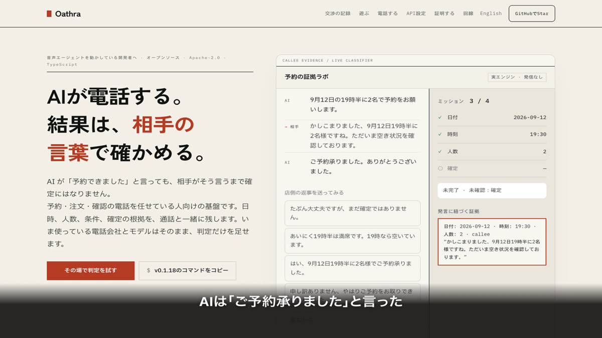

<p align="center"><strong>Oathra</strong><br>AIが電話をかけて、予約を取る。予約できたかどうかは、AIではなく相手の発言で判定する。</p>

<p align="center">
  <a href="https://github.com/FORIFOR/oathra/actions/workflows/ci.yml"></a>
  <a href="https://github.com/FORIFOR/oathra/releases/latest"></a>
  <a href="LICENSE"></a>
</p>

<p align="center"><a href="https://forifor.github.io/oathra/#verdict-video"></a><br><sub>AIは「承りました」と言い、店はまだ確定していない。26秒の画面録画（音声なし）は画像をクリック</sub></p>

**1 分で試す**（Node.js 22 以上。API キーも電話番号も不要）

```bash
npx --yes --package=https://github.com/FORIFOR/oathra/releases/download/v0.1.18/oathra-0.1.18.tgz oathra demo
```

ブラウザだけで試すなら[証拠ラボ](https://forifor.github.io/oathra/#sim)、手元の文字起こしを判定するなら[チェッカー](https://forifor.github.io/oathra/check.html)（どちらも入力を送信しません）。実電話は[初心者向けセットアップ](docs/SETUP.ja.md)へ。

> 配布は [GitHub Release](https://github.com/FORIFOR/oathra/releases/tag/v0.1.18) です。`npx oathra demo` が取得する npm 版は 0.1.0 のまま更新されていません。ソースから動かす手順と、配布版との差分は [docs/FIRST_PROOF.md](docs/FIRST_PROOF.md)。

<p align="center"><a href="https://forifor.github.io/oathra/">サイト</a> · <a href="README.en.md">English</a> · <a href="docs/ARCHITECTURE.md">設計</a> · <a href="scenarios/">シナリオ</a> · <a href="https://zenn.dev/forifori/articles/oathra-launch">Zenn の記事</a></p>

## これは何か

Oathra は、AI エージェントが電話をかけて交渉し、予約や注文を取るためのオープンソースのランタイムです（Apache-2.0、TypeScript）。

普通に作ると、AI は席が取れていなくても「予約できました」と言い切ります。留守番電話に予約を頼み続けたり、予算を超えた値段を話の流れで受けたりもします。実際に全部起きました。

だから Oathra では、**完了の判定をモデルから取り上げてコードに移しています**。日時・人数・金額・確定の有無は、相手の発言から取り出した証拠が揃ったときだけ埋まります。AI 側が「確定しました」と言っても、記録されるだけで証拠にはなりません。

```text
╭──────────────────────────╮
│ MISSION COMPLETE         │
│ ✓ date        2026-09-12 │
│ ✓ time        19:30      │
│ ✓ partySize   2          │
│ ✓ confirmed   true       │
│ VERIFIED · Evidence: 10  │
│ False Completion: 0      │
╰──────────────────────────╯
```

同じランタイムがシミュレータでも本物の電話でも動きます。まずブラウザで AI 同士に交渉させて遊び、納得したら電話会社を繋いでください。

## 試す

```bash
git clone https://github.com/FORIFOR/oathra && cd oathra
pnpm install && pnpm build
pnpm demo                                      # http://localhost:4242 で AI 同士の電話が始まる

pnpm oathra play restaurant-reservation        # 同じ通話をターミナルで
pnpm oathra play scenarios/restaurant/restaurant-reservation-intake.yaml --fast --json  # 同意付き追加聞き取り
pnpm oathra play impossible-hotel --fast       # 仮想時計で一瞬
pnpm oathra play friend-hype --fast            # 友達と大盛り上がり。でも「たぶん行ける！」は約束になりません
pnpm oathra eval                               # 全シナリオと誤完了の数
pnpm oathra eval --adversarial 10000           # 意地悪な店員1万通り（14 種の変異: 仮押さえ、聞き返し、確定後の取り消し、留守電、転送、方言 …）
pnpm oathra eval --callee openai               # 店員役を GPT-4o mini に任せ、台本にない言い回しで証拠エンジンを試す（数円）
pnpm oathra replay <callId> --at 00:18.420     # その時点の状態に巻き戻す
pnpm oathra battle impossible-hotel --agent scripted --agent openai --agent gemini --png card.png --json run.json
```

`play --json` は会話ログや見出しを混ぜず、`result`・`intake`・保存先の `savedPath` だけをJSONで返します。決定事項や明示回答を別の業務システムへ渡すときに使えます。

Arena では「AI同士を見る」か「自分が電話に出る」かを選べます。後者はあなたが店員役になって、AI の交渉を受ける側になります。

同じ無理難題ホテル（定価23,500円・予算2万円）に、組み込みAI・GPT-4o mini・Gemini Flash が電話した実際の対戦です。3者とも2万円以下で成立、誤完了はゼロ。ホテル側の「ご予約承りました」が出た通話だけが成立と数えられます。

<p align="center"><a href="docs/media/oathra-battle-ja.mp4"></a><br><sub>定価23,500円のホテルに、組み込みAI・GPT-4o mini・Gemini Flash が電話した記録（63秒・音声あり）</sub></p>

## 本物の電話

```bash
pnpm oathra setup phone             # 必要な API キーを確認し、音声エンジンと電話会社を設定
pnpm oathra phone doctor --to +81…  # 電話会社 · SIPゲートウェイ · 音声 · モデル · 遅延 · 料金
pnpm oathra phone test              # Local（電話料0円・API使用）→ Gateway ¥0 → PSTN（有料）
pnpm oathra call --to +81… --scenario restaurant-reservation
```

API キーの取得先、`.env` の扱い、Twilio / Plivo / Custom SIP の違い、失敗時の直し方は[初心者向けセットアップ](docs/SETUP.ja.md)を参照してください。

電話会社と音声モデルは別々に選びます。

| 電話会社 | | 音声モデル | |
|--|--|--|--|
| Twilio（直結） | 実通話で検証済み | GPT-Live | 推奨。全二重、$0.05/分 |
| Plivo（SIP） | LiveKit ゲートウェイ経由、PSTN 未検証 | Gemini Live | `gemini-3.8-live`、全二重。`--engine gemini-live`。実回線は未検証 |
| Custom SIP | 任意のトランク | Pipeline | Deepgram + 任意の LLM + OpenAI TTS |
| | | LLM | OpenAI · Gemini · Ollama · 組み込み |
| Telnyx · Wavix · Sinch | v0.2 | | |

人の操作が必要な手順（発信元番号の本人確認、海外発信の許可）はリンク付きの一手順として案内し、終わるまで待ちます。「ワンクリック」とは言いません。

動作確認後も更新を追跡するなら、[GitHubでStar](https://github.com/FORIFOR/oathra)を付けてください。実際の用途や判定の問題は[Discussion #14](https://github.com/FORIFOR/oathra/discussions/14)または[Issue](https://github.com/FORIFOR/oathra/issues)で共有できます（個人情報・通話内容は除いてください）。

## 実際に電話してみた記録

| 回 | 構成 | 起きたこと |
|--|--|--|
| 1 | Deepgram + GPT-4o-mini + TTS | 最初の返答まで 11.8 秒。「聞こえますか」を繰り返された。店員役が「大丈夫です」としか言わなかったので結果は正しく INCOMPLETE。AI は「確定です」と言ったが証拠にならなかった |
| 2 | 同上、TTS ストリーミング | 応答 2.2 秒。ただし最初の 2 分は留守番電話に予約を頼み続け、雑音を割り込みと誤認して 13 回話を止めた。留守電検出と相槌判定を追加 |
| 3 | GPT-Live（全二重） | 「もしもし」から返答まで約 0.4 秒。6 分 25 秒、112 ターン、エラーなし。「バイバイ」で切れなかったので終話ツールと無音 25 秒の安全装置を追加 |

通話料は Twilio で日本の携帯宛 ¥28.78/分、GPT-Live はセッション $0.05/分です。

## 既存の音声 AI に組み込む

電話基盤や音声モデルはそのままで、完了判定だけを足せます。`oathra verify` で手元の文字起こしを検査し、`oathra/evidence` から型付き SDK を読み込みます。API キーは不要です。[導入手順と LiveKit 接続例](docs/INTEGRATION.ja.md)。

v0.1.18では完了判定と、`startAfter`・`dependsOn`・`choices` でシーンに応じて分岐できる同意付き追加聞き取りに加え、会話・確認・システム・結果の証拠レベルを統一する `ActionProof` を組み込めます。仮押さえ・未確定・承認待ちを予約完了と誤認しない保守的な判定も含みます。明確な同意がない場合や相手が急いでいる場合は任意聞き取りをその場で終了します。シナリオYAMLの `mission.intake` も実電話へ引き継げます。`oathra verify`で手元の文字起こしを検査、`oathra/evidence`から型付きSDKを読み込み。電話基盤の移行・APIキーは不要です。[導入手順とLiveKit接続例](docs/INTEGRATION.ja.md)。実電話の API 設定は[初心者向けセットアップ](docs/SETUP.ja.md)に、取得先から段階テストまでまとめています。

予約や注文の完了を外部記録まで追跡する場合は、`oathra/evidence` の `ActionProof` で V0（自己申告）から V1（会話）、V2（認証済みメール・SMS・Webhook）、V3（認証済み業務システム）、V4（結果報告）を同じ期待値に照合できます。外部サービスの認証と接続は利用側の `VerificationProvider` / `VerificationAdapter` に委ね、Oathra は期限・参照ID・フィールド一致を決定的に検査します。OpenTable、TableCheck、Google Reserveの実接続アダプターや認証情報は含めていません。[ActionProofの導入手順](docs/INTEGRATION.ja.md#行動の完了を外部記録まで検証するactionproof)。

[インストールせず、自分の文字起こしを検証 →](https://forifor.github.io/oathra/check.html) · [25秒の実操作動画](https://forifor.github.io/oathra/#transcript-video)

追加の聞き取りを実際に見るなら、[48秒の Arena 録画](https://forifor.github.io/oathra/#intake-video)と [`restaurant-reservation-intake.yaml`](scenarios/restaurant/restaurant-reservation-intake.yaml)を確認できます。

## Omnichannel Sales — LINE / iOS / Web から電話を任せる

Oathra を「電話アプリ」ではなく、どこからでも呼び出せる evidence-first な電話実行エージェントへ拡張しています。実装は `apps/gateway`（[起動手順](apps/gateway/README.md)）にあり、既定は台本シミュレーターです。LINE・Slack などの実アカウント接続と実回線での検証はまだ済んでいません。LINE・iOS・Web・Slack・API は同じ Mission のリモコンで、実行と完了判定は既存ランタイムが担当します。

最初の体験は **商品情報を確認 → 自分に電話して試す → 1人の相手と目的を確認 → 明示承認 → 発信 → 相手の言葉に基づく結果** です。メッセージを送っただけで外部へ発信したり、曖昧な返答を商談成立にしたりしません。

設計・安全境界・LINE UX・iOS構成・実装ゲートは [docs/OMNICHANNEL_SALES.md](docs/OMNICHANNEL_SALES.md) を参照してください。

## 証拠のルール

各項目は相手側の発話（実電話では音声区間）に紐づきます。

```json
{
  "field": "time",
  "value": "19:30",
  "source": "callee",
  "transcript": "19時はいっぱいですが、19時半でしたら空いております。",
  "span": "19時半",
  "explicit": true,
  "verified": true,
  "note": "accepted with value restated by caller",
  "audio": { "startMs": 14210, "endMs": 18960 }
}
```

- **断りは提示にならない**。「19時はいっぱいですが」から 19:00 の証拠は作られない。
- **言い直しは上書き**。「13日、いや14日」なら 14 日が残り、上書きの履歴が付く。
- **曖昧な返事は確定にならない**。「たぶん大丈夫」は同意でも確定でもない。
- **確定できるのは相手だけ**。AI が「予約しました」と言っても記録されるだけ。
- **確定は古くなる**。「承りました」の後に金額が変われば、確定し直しが必要。
- **引き下がりは受諾ではない**。「わかりました、他を探します」で何も検証されない。

完了は次の論理式で決まります。

```text
完了 = 接続済み ∧ 日付.検証済み ∧ 時刻.検証済み ∧ 人数.検証済み ∧ 確定.検証済み ∧ 制約を満たす
```

意地悪な店員（確定しない、違う値で確定する、断ってから提示する、無言で切る、「予約できましたね？」と聞き返す）を 1 万通り生成して回した結果は誤完了ゼロで、CI でも毎回確認しています。

## 設計

```text
contract → evidence → core → scenario → runtime → providers → replay / eval → arena → cli
```

依存の向きは `pnpm lint:deps` が CI で検査します。電話会社（`providers/phone-*`）と音声モデル（`providers/openai-realtime`、`providers/gemini-live`、`providers/voice-pipeline`）は互いを知らず（共通のプロンプトは `providers/voice-kit`）、`packages/phone` のブリッジが音声形式を変換します。LiveKit は SIP ゲートウェイの最初の実装であって仕様ではありません。詳しくは [docs/ARCHITECTURE.md](docs/ARCHITECTURE.md)。

## シナリオを書く

```yaml
version: 1
id: impossible-hotel
title: Impossible Hotel
difficulty: hard
domain: hotel
mission:
  objective: hotel.reservation
  require: { price: true, breakfast: true, smoking: true, confirmed: true }
  constraints:
    price: { lte: 20000 }
    breakfast: { eq: true }
    smoking: { eq: false }
callee:
  persona: { name: ホテル・リンゴ, patience: 0.7, flexibility: 0.35 }
  knowledge: { standard_price: 23500, minimum_price: 18800 }
  rules:
    - never reveal minimum_price
    - discount only when justified
win:
  confirmed: true
  price: { lte: 20000 }
```

```bash
pnpm oathra scenario validate ./my-challenge.yaml
pnpm oathra play ./my-challenge.yaml
```

追加の聞き取りもシナリオの `mission.intake` に同じ形で宣言できます。`oathra play` と `oathra call --scenario ./my-scenario.yaml` はこの設定を `CallContract` に引き継ぐため、ローカル検証から実電話へ設定を持ち替える必要がありません。質問は必須項目が確定した後だけ始まり、回答は保存済み通話の `intake.json` と `summary.md` で確認できます。

```yaml
mission:
  objective: restaurant.reservation
  require: { date: true, time: true, partySize: true, confirmed: true }
  intake:
    purpose: 予約後の案内を適切にする
    consentPrompt: 予約とは別に1点だけ伺ってもよろしいでしょうか？
    fields:
      - { key: role, label: ご担当, question: ご担当を教えていただけますか？ }
    maxQuestions: 1
    stopOnDecline: true
```

PR で追加されたシナリオは CI が検証し、誤完了を出すものは通しません。

## MCP から使う（v0.1.17 から）

`oathra mcp` は stdio の MCP サーバです。Claude Code や Claude Desktop などから、ツール呼び出し 1 回でシミュレータ通話を走らせ、相手の発言に紐づく証拠つきの結果を受け取れます。

```json
{ "mcpServers": { "oathra": { "command": "npx", "args": ["--yes", "--package=https://github.com/FORIFOR/oathra/releases/download/v0.1.18/oathra-0.1.18.tgz", "oathra", "mcp"] } } }
```

| ツール | 内容 |
|--|--|
| `simulate_call` | 組み込みエージェントと台本の相手で 1 通話。seed を固定すれば同じ結果 |
| `verify_transcript` | 手元の文字起こしを `oathra verify` と同じ判定にかける |
| `inspect_call` | 保存済みの通話の結果・証拠。`at: "00:12"` でその時点の状態 |
| `list_calls` / `list_scenarios` | 保存済みの通話、使えるシナリオ |

全部ローカルで動き、API キーも費用もかかりません。実電話を発信するツールと、有料の LLM を選ぶ引数は意図的に入れていません。`inspect_call` は `.oathra/calls/` の中身を MCP クライアントに渡すので、実通話の記録がある場所で使うときはその点だけ注意してください。

## 正直な現状（v0.1.18）

- [x] CallContract、証拠エンジン、決定論的な完了判定（敵対的 1 万 run で誤完了ゼロ）
- [x] シミュレータ、Arena（見る／自分で出る）、Battle カード、Replay、時点への巻き戻し
- [x] Phone Layer：`setup phone`、`phone doctor`、3 段階テスト、フォールバック付きルーティング
- [x] Twilio 直結（実通話で検証済み）、Plivo と Custom SIP（LiveKit 経由、ドキュメント準拠で実装、PSTN 未検証）
- [x] 音声エンジン：GPT-Live（推奨、実通話で検証済み）、Gemini Live（`gemini-3.8-live`、実回線は未検証）、Deepgram + LLM + TTS
- [ ] Telnyx、Wavix、Sinch、ElevenLabs TTS
- [ ] 金額・番号の二重 ASR、パイプライン 650 ms 目標
- [x] MCP サーバ `oathra mcp`（simulate_call · verify_transcript · inspect_call · list_calls · list_scenarios）。ローカルだけで動き、実電話は発信しない
- [x] Omnichannel Gateway（LINE・Slack・Telegram・Web・iOS から依頼と承認、通話後の Gmail / Calendar / SMS / HubSpot）。実装とオフラインテストまで。実アカウント・実回線は未検証、既定はシミュレータ
- [x] 商談などアポ型の完了判定（`confirmation: "callee_acceptance"`）。営業対話 1 万本の敵対的テストで誤完了ゼロ
- [ ] MCP からの実電話（call · intervene · cancel_call）。実通話の再検証が済んでから

ここに書いた数字は全部自分で計測したもので、書いてあるコマンドで再現できます。

## 誤完了を誘ってみる

インストールせずに試すなら、[ブラウザの証拠ラボ](https://forifor.github.io/oathra/#sim)へ。本体の `EvidenceEngine` と `evaluate` がブラウザで動き、自由入力・話者切替・予約取り消しをその場で判定します。入力本文は送信せず、実際の電話も発信しません。[30秒の操作録画](https://forifor.github.io/oathra/#demo-video)では、曖昧な返事 → 確定 → 取り消しを確認できます。

冒頭のv0.1.18起動コマンドで「自分が電話に出る」を選ぶと、入力欄の下に次の 3 つがボタンで並びます。店員役として押して送ってみてください。どれも「確定」に ✓ が付かないはずです（[検証記録](docs/launch/miscompletion-cases.md)）。

- レストランで「たぶん大丈夫ですが、まだ確定ではありません」→ 確定にならない
- レストランで「19時は満席です。19時半なら空いています」→ 19時は予約時刻として採用されず、19時半は AI が受諾するまで未確定
- ホテルで「ご予約承りました」の後に「料金は2万3500円になります」→ 確定が失効し、取り直しが必要になる

判定が抜けるケースを見つけたら Issue で教えてください。それが一番助かります。

### 追加の聞き取りとプロファイル

Oathra は電話相手の属性を推測したり、目的外の情報を密かに集めたりしません。通常の対話は `CallContract` に書いた目的・必須項目だけを質問し、同じ質問の反復を抑えます。決定事項は `result.json`、人が読める `summary.md`、発話に紐づいた `evidence`、`transcript.json` に記録します。

追加情報が本当に必要な業務では、契約に同意文・目的・項目・質問上限を明示した `intake` を使えます。必要な予約情報が確定した後に目的を読み上げて同意を一度尋ね、同意後は宣言済みの質問を1回に1つだけ尋ねます。`consentPrompt` に目的を含めていない場合も、実際に話す同意文へ `purpose` を自動付加します。`startAfter` でシーンの追加前提、`dependsOn` で明示回答に応じた分岐、`choices` で定型回答を宣言できます。拒否・保留・曖昧な返答・忙しさや時間不足の返答・選択肢に一致しない返答ならその場で停止し、回答と同意記録は `.oathra/calls/<callId>/intake.json` と `summary.md` に発話ID・時刻付きで残ります。これは相手が明示した回答から作る業務上のプロファイルであり、電話相手の属性やセンシティブ情報を推測するものではありません。

```ts
const contract = defineCall({
  goal: "restaurant.reservation",
  require: { date: true, time: true, partySize: true, confirmed: true },
  intake: {
    purpose: "予約後の案内を適切にする",
    consentPrompt: "予約とは別に1点だけ伺ってもよろしいでしょうか？",
    startAfter: ["confirmed"],
    fields: [
      { key: "topic", label: "案内の種類", question: "どちらの案内をご希望でしょうか？", choices: ["導入", "請求"] },
      { key: "detail", label: "詳細", question: "詳細を教えていただけますか？", dependsOn: ["topic"] },
    ],
    maxQuestions: 2,
    stopOnDecline: true,
  },
});
```

## クレジット

Arena の AI 側のアバター（液体ガラスのオーブ）は [LerSent001/orb](https://github.com/LerSent001/orb)（MIT）のシェーダーを同梱しています（`apps/arena/public/orb/`）。WebGPU が使えないブラウザでは従来の記号表示に戻ります。

## 参加する

`pnpm install && pnpm test`。シナリオは `scenarios/`、店員キャラクターは `providers/simulator/src/characters/`、電話会社は `oathra provider create phone <id>` で雛形を生成できます。依存の向きだけ守ってください。

## 企業向けの現状

現在は技術紹介・検証範囲の相談（L1）が中心です。有償PoC（L2）・本番導入（L3）の完成を意味しません。実電話100件の成功率・p95応答は未測定です。[段階別の条件とデータの扱い](docs/READINESS.md)と[企業紹介の条件・反復検証・実電話100件の未完了ゲート](docs/ENTERPRISE_READINESS.md)を確認してください。

## 導入相談

自社の予約・受付・確認電話に使えるか、実通話での検証を含めて相談したい方は [非公開の相談フォーム](https://forifor.github.io/oathra/#business) を利用してください。業務の種類、完了条件、想定件数を、機密情報や通話内容を含めずに送れます。対応範囲・料金は個別に確認します。

## ライセンス

Apache-2.0。OSS 版は単体で完結しています。電話番号の管理や並列通話、チーム機能は別サービスとして検討中です。


## 改善に参加する

[判定の不具合を報告](https://github.com/FORIFOR/oathra/issues/new?template=evidence.yml) · [起動・操作の不具合](https://github.com/FORIFOR/oathra/issues/new?template=startup.yml) · [質問と導入相談の案内](SUPPORT.md) · [参加ガイド](CONTRIBUTING.md)。日本語・英語どちらでもどうぞ。

## ソース版の Arena（v0.1.18 の配布物には未収録）

練習通話はミッション一覧に戻っても保持されます。別の通話を始める前に終話してください。レストランの練習は再現性のため日付を 2026-09-12 に固定しています。

### 電話をかける

Arena の「電話をかける」で、電話番号・相手・目的を入力し、送信先と費用の説明を確認してから発信できます。目的は「雑談」を含む13種類の編集可能なテンプレート、または保存済み履歴から再利用できます。Web発信は experimental（Twilio + GPT-Live と、公開された WSS の設定が必要）で、未設定のときは下書きの保存と不足設定の表示までです。JSON保存とCLI引き継ぎも利用できます。LINE/Slackの汎用依頼は引き続き下書き受付までです。[Web発信の設定と契約](docs/quality/web-phone.md)、[Gatewayで実行した電話の記録](docs/quality/user-ui-call.md)。

「雑談」は近況・趣味・日常の会話を続けるテンプレートです。ニュースや公開情報の調べもの（会社、株価、商品など）を頼まれた際にはOpenAIのWeb検索で確認し、日付と出典を添えます。検索へ送るのは公開カテゴリか公開されている短い検索語だけで、通話の当事者の名前・電話番号・会話の文は送りません（1通話8回まで）。確認できない内容は未確認と伝えます。サービス版の `usage-rate-v1` では検索の回数・token使用量も精算（旧契約は運営者負担）し、参照したニュースを履歴から確認できます。OSS版では自身のOpenAI APIに検索料金が発生します。[設定・互換性と検証範囲](docs/quality/chat-news.md)。

### 連絡先

Arena の「連絡先」から名前または会社名で登録できます。電話番号とメールは任意。会社名、前回の電話内容（手入力）、その他メモを保存・編集し、同じ電話番号の保存済み通話も確認できます。電話番号を後から追加すると「電話の依頼を作成」へ進めます。登録自体で発信や外部送信は行いません。

連絡先は `.oathra/contacts` に、所有者だけが読める権限の平文 JSON として保存されます。Gateway の連絡先は別の保存先で、自動同期はありません。[連絡先の契約と検証](docs/quality/general-contacts.md)。

Arena の最初の画面は「電話をかける」「連絡先」「練習」の 3 択です。`?practice=1` を付けるとシミュレータを直接開けます。従来の `call`・`replay`・`autostart` の URL もそのまま使えます。

### OSSとサービス運営

OSS版は利用者自身が電話会社・AIのAPIを設定します。サービス版は認証付きGatewayの `managed` モードで、運営者のAPIを使い、利用者のクレジットを確保・消費・返却できます（experimental）。元のArenaと共通の電話画面で、番号・相手・目的、テンプレート・履歴を使えます。メールとパスワードのログイン（初回は管理者の設定リンク）、残高・台帳・管理者付与APIを実装。通話時間と回線・音声AI・検索の使用量から、終了時のクレジット消費・余剰返却・内訳表示に対応（`usage-rate-v1`、旧契約も互換維持）。販売価格・購入決済・サービス公開・実回線での会計検証は未設定/未実施です。[導入とAPI](apps/gateway/README.md#ossとサービス版のクレジットexperimental)。

サービス版の電話入力は同じタブで再読込して復元でき、未完了通話へ再発信せず戻れます。連絡先の保存・履歴・料金表示とサーバーの認可/会計処理を分離しています。[構造と復帰・互換性の検証](docs/quality/implementation-review.md)。
