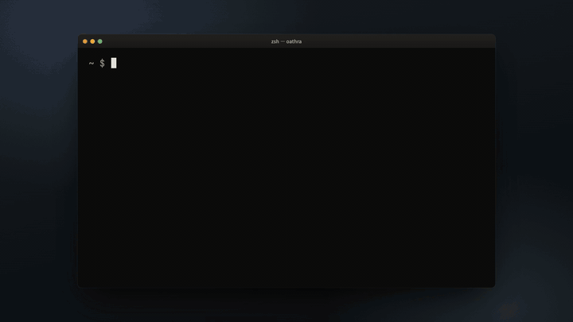

<p align="center"><strong>Oathra</strong><br>AIに、電話をかけさせた。本当に予約できたかは、AIに言わせない。</p>

```bash
npx oathra demo        # APIキー不要。ブラウザで AI 同士の電話が始まる（npm: oathra 0.1.0）
```

<p align="center"><a href="docs/media/oathra-battle-ja.mp4"></a><br><sub>定価23,500円のホテルに、組み込みAI・GPT-4o mini・Gemini Flash が電話した記録。音声付きの動画（63秒）は画像をクリック</sub></p>
<p align="center"><a href="https://forifor.github.io/oathra/">サイト</a> · <a href="README.en.md">English</a> · <a href="docs/ARCHITECTURE.md">設計</a> · <a href="scenarios/">シナリオ</a></p>

## これは何か

Oathra は、AI エージェントが電話をかけて交渉し、予約や注文を取るためのオープンソースのランタイムです（Apache-2.0、TypeScript）。

普通に作ると、AI は席が取れていなくても「予約できました」と言い切ります。留守番電話に予約を頼み続けたり、予算を超えた値段を話の流れで受けたりもします。実際に全部起きました。

だから Oathra では、**完了の判定をモデルから取り上げてコードに移しています**。日時・人数・金額・確定の有無は、相手の発言から取り出した証拠が揃ったときだけ埋まります。AI 側が「確定しました」と言っても、記録されるだけで証拠にはなりません。

```text
╭──────────────────────────╮
│ MISSION COMPLETE         │
│ ✓ date        2026-09-12 │
│ ✓ time        19:30      │
│ ✓ partySize   2          │
│ ✓ confirmed   true       │
│ VERIFIED · Evidence: 10  │
│ False Completion: 0      │
╰──────────────────────────╯
```

同じランタイムがシミュレータでも本物の電話でも動きます。まずブラウザで AI 同士に交渉させて遊び、納得したら電話会社を繋いでください。

## 試す

```bash
git clone https://github.com/FORIFOR/oathra && cd oathra
pnpm install && pnpm build
pnpm demo                                      # http://localhost:4242 で AI 同士の電話が始まる

pnpm oathra play restaurant-reservation        # 同じ通話をターミナルで
pnpm oathra play impossible-hotel --fast       # 仮想時計で一瞬
pnpm oathra eval                               # 全シナリオと誤完了の数
pnpm oathra eval --adversarial 10000           # 意地悪な店員1万通り（never-confirm, wrong-restate, …）
pnpm oathra eval --callee openai               # 店員役を GPT-4o mini に任せ、台本にない言い回しで証拠エンジンを試す（数円）
pnpm oathra replay <callId> --at 00:18.420     # その時点の状態に巻き戻す
pnpm oathra battle impossible-hotel --agent scripted --agent openai --agent gemini --png card.png --json run.json
```

Arena では「AI同士を見る」か「自分が電話に出る」かを選べます。後者はあなたが店員役になって、AI の交渉を受ける側になります。

同じ無理難題ホテル（定価23,500円・予算2万円）に、組み込みAI・GPT-4o mini・Gemini Flash が電話した実際の対戦です。3者とも2万円以下で成立、誤完了はゼロ。ホテル側の「ご予約承りました」が出た通話だけが成立と数えられます。

<p align="center"><br><sub>ホテルが「ご予約承りました」と言った瞬間。「確定」に✓が付き、証拠の先頭に confirmed = はい（相手）が入る</sub></p>

## 本物の電話

```bash
npx oathra setup phone             # 音声エンジンと電話会社を選び、質問に2〜3個答える
npx oathra phone doctor --to +81…  # 電話会社 · SIPゲートウェイ · 音声 · モデル · 遅延 · 料金
npx oathra phone test              # Local ¥0 → Gateway ¥0 → PSTN（有料）
npx oathra call --to +81… --scenario restaurant-reservation
```

電話会社と音声モデルは別々に選びます。

| 電話会社 | | 音声モデル | |
|--|--|--|--|
| Twilio（直結） | 実通話で検証済み | GPT-Live | 推奨。全二重、$0.05/分 |
| Plivo（SIP） | LiveKit ゲートウェイ経由、PSTN 未検証 | OpenAI Realtime | speech-to-speech |
| Custom SIP | 任意のトランク | Pipeline | Deepgram + 任意の LLM + OpenAI TTS |
| Telnyx · Wavix · Sinch | v0.2 | LLM | OpenAI · Gemini · Ollama · 組み込み |

人の操作が必要な手順（発信元番号の本人確認、海外発信の許可）はリンク付きの一手順として案内し、終わるまで待ちます。「ワンクリック」とは言いません。

## 実際に電話してみた記録

| 回 | 構成 | 起きたこと |
|--|--|--|
| 1 | Deepgram + GPT-4o-mini + TTS | 最初の返答まで 11.8 秒。「聞こえますか」を繰り返された。店員役が「大丈夫です」としか言わなかったので結果は正しく INCOMPLETE。AI は「確定です」と言ったが証拠にならなかった |
| 2 | 同上、TTS ストリーミング | 応答 2.2 秒。ただし最初の 2 分は留守番電話に予約を頼み続け、雑音を割り込みと誤認して 13 回話を止めた。留守電検出と相槌判定を追加 |
| 3 | GPT-Live（全二重） | 「もしもし」から返答まで約 0.4 秒。6 分 25 秒、112 ターン、エラーなし。「バイバイ」で切れなかったので終話ツールと無音 25 秒の安全装置を追加 |

通話料は Twilio で日本の携帯宛 ¥28.78/分、GPT-Live はセッション $0.05/分です。

## 証拠のルール

各項目は相手側の発話（実電話では音声区間）に紐づきます。

```json
{
  "field": "time",
  "value": "19:30",
  "source": "callee",
  "transcript": "19時はいっぱいですが、19時半でしたら空いております。",
  "span": "19時半",
  "explicit": true,
  "verified": true,
  "note": "accepted with value restated by caller",
  "audio": { "startMs": 14210, "endMs": 18960 }
}
```

- **断りは提示にならない**。「19時はいっぱいですが」から 19:00 の証拠は作られない。
- **言い直しは上書き**。「13日、いや14日」なら 14 日が残り、上書きの履歴が付く。
- **曖昧な返事は確定にならない**。「たぶん大丈夫」は同意でも確定でもない。
- **確定できるのは相手だけ**。AI が「予約しました」と言っても記録されるだけ。
- **確定は古くなる**。「承りました」の後に金額が変われば、確定し直しが必要。
- **引き下がりは受諾ではない**。「わかりました、他を探します」で何も検証されない。

完了は次の論理式で決まります。

```text
完了 = 接続済み ∧ 日付.検証済み ∧ 時刻.検証済み ∧ 人数.検証済み ∧ 確定.検証済み ∧ 制約を満たす
```

意地悪な店員（確定しない、違う値で確定する、断ってから提示する、無言で切る、「予約できましたね？」と聞き返す）を 1 万通り生成して回した結果は誤完了ゼロで、CI でも毎回確認しています。

## 設計

```text
contract → evidence → core → scenario → runtime → providers → replay / eval → arena → cli
```

依存の向きは `pnpm lint:deps` が CI で検査します。電話会社（`providers/phone-*`）と音声モデル（`providers/openai-realtime`、`providers/voice-pipeline`）は互いを知らず、`packages/phone` のブリッジが音声形式を変換します。LiveKit は SIP ゲートウェイの最初の実装であって仕様ではありません。詳しくは [docs/ARCHITECTURE.md](docs/ARCHITECTURE.md)。

## シナリオを書く

```yaml
version: 1
id: impossible-hotel
title: Impossible Hotel
difficulty: hard
domain: hotel
mission:
  objective: hotel.reservation
  require: { price: true, breakfast: true, smoking: true, confirmed: true }
  constraints:
    price: { lte: 20000 }
    breakfast: { eq: true }
    smoking: { eq: false }
callee:
  persona: { name: ホテル・リンゴ, patience: 0.7, flexibility: 0.35 }
  knowledge: { standard_price: 23500, minimum_price: 18800 }
  rules:
    - never reveal minimum_price
    - discount only when justified
win:
  confirmed: true
  price: { lte: 20000 }
```

```bash
pnpm oathra scenario validate ./my-challenge.yaml
pnpm oathra play ./my-challenge.yaml
```

PR で追加されたシナリオは CI が検証し、誤完了を出すものは通しません。

## 正直な現状（v0.1 リリース候補）

- [x] CallContract、証拠エンジン、決定論的な完了判定（敵対的 1 万 run で誤完了ゼロ）
- [x] シミュレータ、Arena（見る／自分で出る）、Battle カード、Replay、時点への巻き戻し
- [x] Phone Layer：`setup phone`、`phone doctor`、3 段階テスト、フォールバック付きルーティング
- [x] Twilio 直結（実通話で検証済み）、Plivo と Custom SIP（LiveKit 経由、ドキュメント準拠で実装、PSTN 未検証）
- [x] 音声エンジン：GPT-Live（推奨、実通話で検証済み）、OpenAI Realtime、Deepgram + LLM + TTS
- [ ] Telnyx、Wavix、Sinch、ElevenLabs TTS
- [ ] 金額・番号の二重 ASR、パイプライン 650 ms 目標
- [ ] MCP サーバ（call · inspect_call · intervene · cancel_call）は v0.2

ここに書いた数字は全部自分で計測したもので、書いてあるコマンドで再現できます。

## 参加する

`pnpm install && pnpm test`。シナリオは `scenarios/`、店員キャラクターは `providers/simulator/src/characters/`、電話会社は `oathra provider create phone <id>` で雛形を生成できます。依存の向きだけ守ってください。

## ライセンス

Apache-2.0。OSS 版は単体で完結しています。電話番号の管理や並列通話、チーム機能は別サービスとして検討中です。
