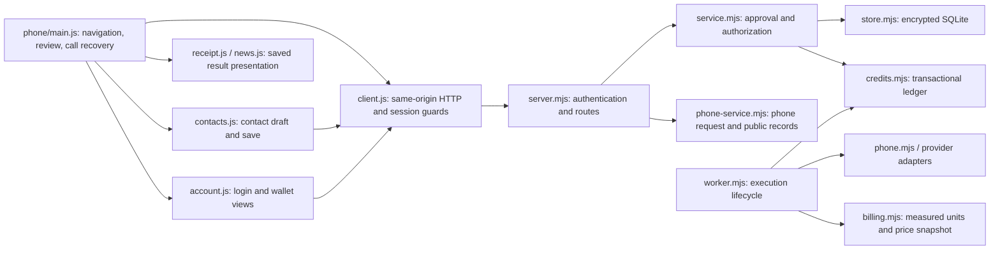

# Architecture

## Dependency direction

```
contract → evidence → core → scenario → runtime → providers → replay / eval → arena → cli
```

`scripts/check-deps.mjs` fails CI on any import that goes the wrong way. Providers never import from core's consumers; the UI only drives the runtime.

## The call loop (`packages/runtime`)

1. `call.started` → `DIALING` → `transport.connect()`
2. Consume `SessionEvent`s. `speech` events are already-transcribed far-end utterances (the simulator delivers text; audio transports run STT + TurnEngine and deliver the same event).
3. Each callee utterance is ingested by the `EvidenceEngine` → `evidence.created` / `evidence.verified` / `mission.progress`.
4. `THINKING`: the `BrainProvider` receives a `BrainContext` with the contract, transcript, **MissionView** (verified / callee-pending / missing / violations) and optional consent-gated intake state. It returns text; it never decides completion.
5. `VERIFYING` / `AWAITING_PERMISSION`: requested actions are checked against `contract.permissions`; the `PermissionGate` (human-in-the-loop) is asked only for actions the contract did not pre-authorise.
6. `SYNTHESIZING` → `SPEAKING` → `session.speak()`; a `TurnTrace` records speech_end → turn_confirm → brain → tts → playback and TTFA.
7. On hangup / budget / cancel: `evaluate(contract, engine, connection)` → `result`.

## Evidence rules (v0.1)

- Utterances are split into clauses; clauses containing refusal phrases are negative and produce no offers.
- Callee offer + caller acceptance (next caller turn, same or no value restated) → verified, edge `accepted_by`.
- Caller proposal + callee agreement (next callee turn) → verified, edge `confirmed_by`.
- A newer claim on a field supersedes a pending one (`supersedes`).
- `confirmed` is verified only by explicit callee confirmation phrases.
- The MissionView shown to brains exposes only *callee* pending offers so an agent cannot accept its own proposal.
- `confirmation: "callee_acceptance"` (contract option, off by default) is for appointment-style calls where the caller proposes a slot: the callee's clean commitment (「はい、9月25日の15時でお願いします」) verifies `confirmed` once date and time are stated or settled. Hedges, deferrals (「上司に聞いてから」), scheduling conflicts (「別の会議が入っています」), contrasts and questions never do. Reservation contracts keep the default and still require an explicit confirmation phrase.

## Closed-loop action proof

`packages/evidence/src/proof.ts` extends conversation evidence without coupling the evidence package to a vendor or network client:

1. `conversationObservation()` maps an existing `VerifiedResult` to V1 conversation proof.
2. A host-owned `VerificationProvider` / `VerificationAdapter` authenticates an email, SMS, webhook, browser, calendar, POS or reservation API record and returns a `ProofObservation`.
3. `evaluateActionProof()` compares every observation with the same `ActionExpectation`, checks source authentication, stable reference IDs, exact fields and freshness, then selects the highest valid level (V0 claimed → V1 conversation → V2 confirmation → V3 system → V4 outcome).

Invalid external observations remain in the audit checks and cannot upgrade a result. A valid lower-level observation is retained when a higher-level record conflicts or expires. Provider credentials, partner agreements and PII retention stay outside Oathra; this repository ships no vendor adapter or network call.

## Voice engines

Speech-to-speech engines implement `VoiceEngine` from `packages/voice`: `providers/openai-realtime` (GPT-Live) and `providers/gemini-live` (Gemini Live, `gemini-3.8-live`). They never import each other; the system prompts, the reservation-desk tools and farewell detection they share live in `providers/voice-kit`. A phone request may name its `engine`; the CLI's `--engine`, the Arena's and the Gateway's 「音声AI」 selector all resolve to the same `buildEngine`.

## Simulator

`SimulatorTransport` implements `TransportProvider`; a `CalleeCharacter` answers. Scripted characters are deterministic (seeded) and expose `truth()` so eval can detect false completions. `HumanCharacter` lets a person answer in Play mode. Pace `realtime` sleeps for speech durations; `fast` uses a virtual clock.

## Recording layout

```
.oathra/calls/<callId>/
  events.jsonl   contract.json   result.json   summary.md   metrics.json   transcript.json   traces.json   intake.json
  (caller.opus / callee.opus / mixed.opus on audio transports)
```

## Managed phone application (experimental Gateway v1)

The managed adapter reuses Arena's phone and contacts HTML/CSS. It does not run the
Arena simulator script or duplicate charging rules. Missing HTML integration slots
fail explicitly in `apps/gateway/lib/phone-ui.mjs` instead of serving an incomplete UI.



Browser modules are native ES modules with a fixed server asset allowlist. Provider
keys never enter them. `managed-phone.js` remains a compatibility entry loader.
`main.js` owns the selected call and ignores superseded reads. Mutations are never
retried automatically. An accepted start followed by a failed read remains accepted
or unconfirmed, and is recovered by querying the same call. Poll failures retry reads
only. Logout/expiry invalidate pending UI responses; SSE reauthenticates on every poll.

Unfinished phone/contact forms, pending contact-save keys and the selected call ID are saved in **same-tab sessionStorage,
scoped to the authenticated owner**. Explicit logout deletes that owner's recovery
entry; expiry hides private views but allows recovery after reauthentication. This is
browser-local form recovery, not server archival; tab closure/private browsing may
remove it. Submitted drafts, conversations, usage and ledger entries use encrypted
server storage. A read-only `?call=<owned mission ID>` can open a saved record; it never
starts or repeats a call.

Contacts have their own edit state and save guard. Save responses cannot erase newer
typing or switch to another editor. A lost save response retains the exact payload
and idempotency key; explicit retry confirms that write before saving later changes.
The server transaction scopes contact-save keys by owner for 24 hours. Omitted update
fields retain their values; explicit empty strings clear optional text/phone fields.
See the Gateway README for the experimental API compatibility change.
